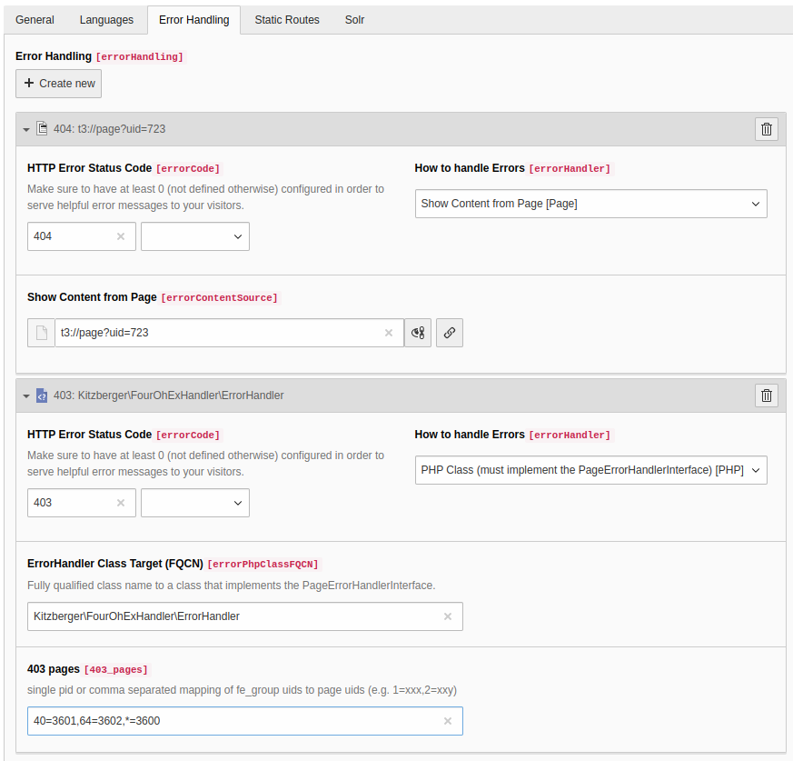

# TYPO3 Extension fox\_handler

This extension provides a handler for page access errors (formerly known as `pageNotFoundHandler`) that is able to handle 403 responses.

## Installation

### Configuration

#### With site configurations (modern)

In the site configuration mask you need to setup a PHP error handler pointing to `Kitzberger\FourOhExHandler\ErrorHandler` and set the 404 respective 403 page(s):


### 403 pages

Here you've got two options:

* set it to a single pid, e.g. `123`
* set it to a mapping of "fe\_groups to pids", e.g. `40=3601,64=3602`

The latter example means that the user is being forwarded to

* page 3601 when accessing a page that's only visible for fe\_group 40
* page 3602 when accessing a page that's only visible for fe\_group 64

In either case the user is being forwarded with an additional GET parameter `redirect_url` containing the accessed URL.

Hint:

* Use `-2` as fe\_group option "Show at any login".
* Use `*` as a wild card. Makes sense at the end of the mapping list.

Here's an example page's "Usergroup Access Rights":


When determining the right 403 page the extension checks for all of the pages fe\_groups for which one a 403 page has been configured. The first one found will be taken.

## Trouble shooting

The extension uses TYPO3's logger interface, so by adding this to your configuration (e.g. `AdditionalConfiguration.php`) you can have a look into the program's flow:

```php
$logWriterConf = [
    'Kitzberger' => [
        'FourOhExHandler' => [
            'writerConfiguration' => [
                \TYPO3\CMS\Core\Log\LogLevel::DEBUG => [
                    \TYPO3\CMS\Core\Log\Writer\FileWriter::class => [
                        'logFileInfix' => 'fox-handler'
                    ],
                ],
            ],
        ],
    ],
];
$GLOBALS['TYPO3_CONF_VARS']['LOG'] = array_replace_recursive($GLOBALS['TYPO3_CONF_VARS']['LOG'], $logWriterConf);
```
