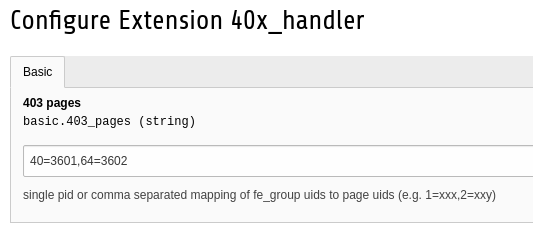
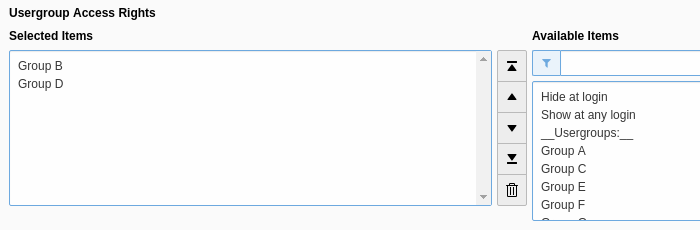

# TYPO3 Extension four0x_handler

This extension provides a `pageNotFoundHandler` that is able to handle both 404 and 403 responses.

## Installation

In the extensions configuration mask there's two inputs to set the 404 respective 403 page(s):


### 404 page

Set it to a page's uid. That page will be fetched and shown to the user whenever a real 404 is being triggered.

### 403 pages

Here you've got two options:
* set it to a single pid, e.g. `123`
* set it to a mapping of "fe_groups to pids", e.g. `40=3601,64=3602`

The latter example means that the user is being forwarded to
* page 3601 when accessing a page that's only visible for fe_group 40
* page 3602 when accessing a page that's only visible for fe_group 64

In either case the user is being forwarded with an additional GET parameter `redirect_url` containing the accessed URL.

Hint:
* Use `-2` as fe_group option "Show at any login".
* Use `*` as a wild card. Makes sense at the end of the mapping list.

Here's an example page's "Usergroup Access Rights":


When determining the right 403 page the extension checks for all of the pages fe_groups for which one a 403 page has been configured. The first one found will be taken.

## Trouble shooting

The extension uses TYPO3's logger interface, so by adding this to your configuration (e.g. `AdditionalConfiguration.php`) you can have a look into the program's flow:

```
$logWriterConf = [
    // Set log config for namespace \Kitzberger\FourOhExHandler
    'Kitzberger' => [
        'FourOhExHandler' => [
            'writerConfiguration' => [
                \TYPO3\CMS\Core\Log\LogLevel::DEBUG => [
                    // logging to a file
                    \TYPO3\CMS\Core\Log\Writer\FileWriter::class => [
                        'logFile' => 'typo3temp/logs/four0x-handler.log'
                    ],
                ],
            ],
        ],
    ],
];
$GLOBALS['TYPO3_CONF_VARS']['LOG'] = array_replace_recursive($GLOBALS['TYPO3_CONF_VARS']['LOG'], $logWriterConf);
```
